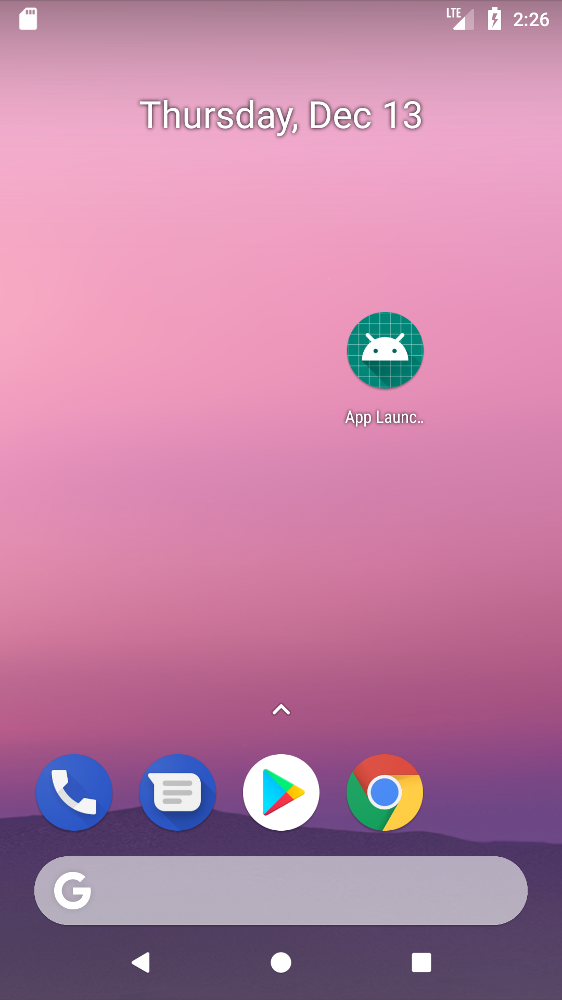
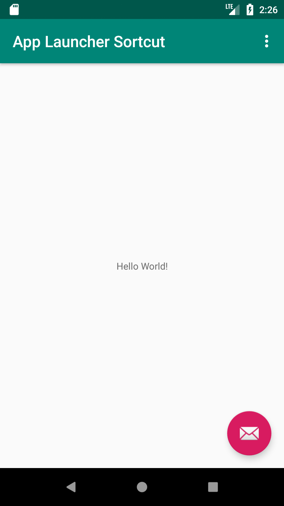

# App-Launcher-Sortcut

# Creating  App Shortcuts in Launcher

##  Overview

Android 7.1 allows you to define shortcuts to specific actions in your app. These shortcuts can be displayed in a supported launcher. Shortcuts let your users quickly start tasks within your app:

  

# Usage

## Static shortcut

In your app’s manifest file (AndroidManifest.xml), find an activity whose intent filters are set to the android.intent.action.MAIN action and the android.intent.category.LAUNCHER category

-       <activity
            android:name=".MainActivity"
            android:label="@string/app_name"
            android:theme="@style/AppTheme.NoActionBar">
            <intent-filter>
                <action android:name="android.intent.action.MAIN" />

                <category android:name="android.intent.category.LAUNCHER" />
            </intent-filter>
            <meta-data android:name="android.app.shortcuts"
                android:resource="@xml/shortcuts" />
        </activity>
        
## shortcut.xml will be under xml under res folder and will look like this

        - <shortcuts xmlns:android="http://schemas.android.com/apk/res/android"
            xmlns:tools="http://schemas.android.com/tools"
            tools:targetApi="25">
            <shortcut
                android:enabled="true"
                android:icon="@drawable/home"
                android:shortcutId="srtone"
                android:shortcutShortLabel="@string/option_one">
                <intent
                    android:action="android.intent.action.VIEW"
                    android:targetClass="card.scratch.com.applaunchersortcut.MainActivity"
                    android:targetPackage="card.scratch.com.applaunchersortcut">
                </intent>
                <categories android:name="android.shortcut.conversation" />
            </shortcut>
            <shortcut
                android:enabled="true"
                android:icon="@drawable/music"
                android:shortcutId="srttwo"
                android:shortcutShortLabel="@string/option_two">
                <intent
                    android:action="android.intent.action.VIEW"
                    android:targetClass="card.scratch.com.applaunchersortcut.MainActivity"
                    android:targetPackage="card.scratch.com.applaunchersortcut">
                </intent>
                <categories android:name="android.shortcut.conversation" />
            </shortcut>
            <shortcut
                android:enabled="true"
                android:icon="@drawable/play"
                android:shortcutId="srtthree"
                android:shortcutShortLabel="@string/option_three">
                <intent
                    android:action="android.intent.action.VIEW"
                    android:targetClass="card.scratch.com.applaunchersortcut.MainActivity"
                    android:targetPackage="card.scratch.com.applaunchersortcut">
                </intent>
                <categories android:name="android.shortcut.conversation" />
            </shortcut>
        </shortcuts>

##  if your Activity is expecting some extras you can always pass it with extra tag like this

          - <intent
                    ...
                       <extra
                             android:name="key"
                             android:value="value" />
                </intent>

Copyright [2018] [purushottamyede]

Licensed under the Apache License, Version 2.0 (the "License");
you may not use this file except in compliance with the License.
You may obtain a copy of the License at

    http://www.apache.org/licenses/LICENSE-2.0

Unless required by applicable law or agreed to in writing, software
distributed under the License is distributed on an "AS IS" BASIS,
WITHOUT WARRANTIES OR CONDITIONS OF ANY KIND, either express or implied.
See the License for the specific language governing permissions and
limitations under the License.
